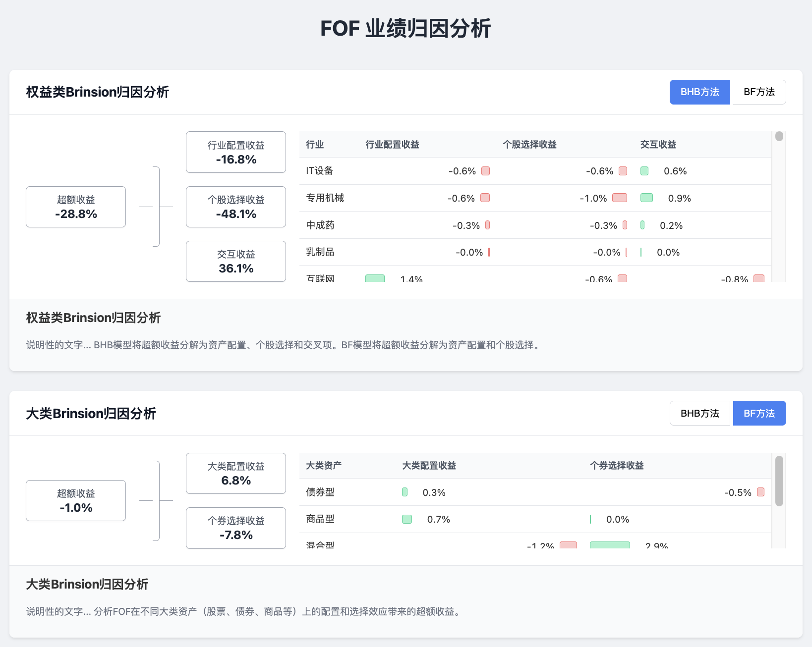

# FOF 业绩归因分析工具

## 1. 项目概述

本项目提供了一套完整的 FOF (Fund of Funds) 业绩归因分析流程，主要包含三种归因模型：

1.  **权益类 Brinsion 归因**: 分析 FOF 在股票投资上的超额收益来源，分解为行业配置 (AR)、个股选择 (SR) 和交叉项 (IR)。
2.  **大类资产 Brinsion 归因**: 分析 FOF 在大类资产（如股票、债券、混合、货币、商品）配置上的超额收益来源。
3.  **债券类 Campisi 归因**: 专门针对 FOF 中的债券部分，将收益分解为票息、资本利得、久期效应和利差效应。

项目代码通过模块化的 Python 脚本实现，分为数据获取、单基金归因计算和 FOF 组合归因聚合三个主要步骤。

## 2. 前端功能概览

本项目配备了一个动态的前端展示页面，用于将复杂的归因数据进行可视化，其核心功能包括：

- **三大归因模块**:
    1.  **权益类Brinsion归因**: 以层级关系图展示超额收益到“行业配置”、“个股选择”和“交互收益”的分解。右侧以可滚动的表格详细展示每个行业的具体贡献，并用红/绿条形图进行可视化。
    2.  **大类Brinsion归因**: 结构与权益类归因类似，分析 FOF 在股票、债券、商品等大类资产上的配置与选择效应。
    3.  **债券Campisi归因**: 通过清晰的树状图，将债券总收益分解为“票息收益”和“资本利得”，并进一步细分为“国债效应”和“利差效应”。

- **交互式分析**:
    - 在Brinsion归因模块中，用户可以通过点击 `BHB方法` / `BF方法` 页签，实时切换归因模型并查看对应的结果。

- **数据可视化**:
    - **层级分解图**: 直观地展示各项收益的构成与来源。
    - **贡献度详情表**: 在Brinsion分析中，用表格清晰列出每个细分项（行业/大类）的贡献度。
    - **可视化条形图**: 表格中的正、负贡献值通过绿色和红色的条形图展示，使数据对比更加直观。

## 3. 环境准备

### a. 配置文件

为了从 Tushare 获取数据，您需要在项目根目录下创建一个 `tushare_config.py` 文件，并填入您的 Tushare token，格式如下：

```python
# tushare_config.py
import tushare as ts

ts.set_token('YOUR_TUSHARE_TOKEN')
pro = ts.pro_api()
```

### b. 安装依赖

请确保安装了所有必需的 Python 库。您可以通过 pip 安装它们：

```bash
pip install pandas numpy akshare tushare tqdm
```
*注意：脚本中使用了 `parquet` 文件格式，需要 `pyarrow` 库支持。*
```bash
pip install pyarrow
```

### c. 目录结构

代码会自动创建 `data/` 和 `output/` 目录，用于存放中间数据和最终结果。

- `data/`: 存放从网络获取的原始数据和预处理数据。
- `output/`: 存放归因计算的最终结果。

## 4. 计算流程

请严格按照以下顺序执行脚本，以确保数据流的正确性。

### 流程一：FOF权益类Brinsion归因

此流程用于计算 FOF 组合在权益投资方面的 Brinsion 归因。

**第 1 步：获取数据**

运行 `A01_equity_brinsion_get_data.py`。

```bash
python A01_equity_brinsion_get_data.py
```

- **功能**:
    - 根据 `fund_code_list` 和 `index_code` 中的配置，获取 FOF 持有的子基金和业绩基准指数的信息。
    - 获取所有相关股票的持仓、行业分类及日行情数据。
- **输入**:
    - 脚本内硬编码的 `fund_code_list` (FOF持仓的权益类基金) 和 `index_code` (业绩基准)。
- **输出**:
    - `data/fund_hold.parquet`: 基金持仓数据。
    - `data/index_hold.parquet`: 基准指数成分股数据。
    - `data/stock_info.parquet`: 股票基本信息（含行业）。
    - `data/stock_daily.parquet`: 股票日行情数据。
    - `data/index_daily.parquet`: 指数日行情数据。

**第 2 步：计算单个基金的归因**

运行 `A02_equity_brinsion_cal_fund_cib.py`。

```bash
python A02_equity_brinsion_cal_fund_cib.py
```

- **功能**:
    - 读取 `data/` 目录下的数据。
    - 对 `fund_hold.parquet` 中的每一只基金，分别计算其相对于基准的 Brinsion 归因因子（同时支持 BHB 和 BF 模型）。
- **输入**:
    - `data/` 目录下的所有 Parquet 文件。
    - 脚本内硬编码的 `start` 和 `end` 日期。
- **输出**:
    - `output/A_bhb_summary.parquet`: BHB 模型下所有单基金的归因结果（长表）。
    - `output/A_bf_summary.parquet`: BF 模型下所有单基金的归因结果（长表）。

**第 3 步：聚合计算FOF组合的归因**

运行 `A03_equity_brinsion_cal_fof_cib.py`。

```bash
python A03_equity_brinsion_cal_fof_cib.py
```

- **功能**:
    - 根据 FOF 组合中各子基金的权重，将上一步计算出的单基金归因结果进行加权聚合。
- **输入**:
    - `output/A_bhb_summary.parquet` 和 `output/A_bf_summary.parquet`。
    - 脚本内硬编码的 `fof_hold` (FOF组合的持仓权重)。
- **输出**:
    - `output/A_bhb_fof_agg.parquet`: FOF 组合的最终 BHB 归因结果。
    - `output/A_bf_fof_agg.parquet`: FOF 组合的最终 BF 归因结果。

---

### 流程二：FOF大类Brinsion归因

此流程用于计算 FOF 在大类资产配置层面的 Brinsion 归因。

**第 1 步：获取数据**

运行 `B01_category_brinsion_get_data.py`。

```bash
python B01_category_brinsion_get_data.py
```

- **功能**:
    - 获取 FOF 持仓中所有子基金的基金类型（股票型、债券型等）。
    - 获取子基金和基准指数的净值/价格数据。
- **输入**:
    - 脚本内硬编码的 `fof_holding` (FOF持仓权重) 和 `benchmark_holding` (基准的大类资产权重)。
- **输出**:
    - `data/fund_info.parquet`: 基金基本信息（含类型）。
    - `data/fof_holding.parquet`: FOF 持仓权重。
    - `data/fund_daily_return.parquet`: 子基金复权净值数据。
    - `data/benchmark_holding.parquet`: 基准指数权重。
    - `data/csi_index_type.parquet`: 基准指数对应的大类。
    - `data/index_daily_all.parquet`: 基准指数日行情数据。

**第 2 步：计算FOF组合的大类归因**

运行 `B02_category_brinsion_cal_fof_cib.py`。

```bash
python B02_category_brinsion_cal_fof_cib.py
```

- **功能**:
    - 读取 `data/` 目录下的相关数据。
    - 直接计算 FOF 组合在大类资产配置上的 Brinsion 归因 (AR 和 SR)。
- **输入**:
    - `data/` 目录下的所有相关 Parquet 文件。
    - 脚本内硬编码的 `start` 和 `end` 日期。
- **输出**:
    - `output/B_category_brinsion_bf.parquet`: FOF 组合的 BF 大类归因结果。
    - `output/B_category_brinsion_bhb.parquet`: FOF 组合的 BHB 大类归因结果。

---

### 流程三：FOF债券类Campisi归因

此流程用于对 FOF 组合中的债券投资部分进行 Campisi 归因分析。

**第 1 步：获取数据**

运行 `C01_campisi_get_data.py`。

```bash
python C01_campisi_get_data.py
```

- **功能**:
    - 准备 Campisi 模型所需的特定数据，包括 FOF 持仓、基金财务数据（利息收入、市值等）、基金久期和国债收益率曲线。
- **输入**:
    - 脚本内硬编码的 `fof_holding`, `in_p_data`, `start_p_data`, `start_yield`, `end_yield` 等。
- **输出**:
    - `data/fof_holding_campisi.parquet`: FOF 债券部分持仓。
    - `data/in_p_data_campisi.parquet`: 区间内财务数据。
    - `data/start_p_data_campisi.parquet`: 期初财务数据。
    - `data/yield_curve_campisi.parquet`: 国债收益率曲线。
    - `data/fund_info.parquet`: （如果不存在）基金基本信息。

**第 2 步：计算单个债券基金的归因**

运行 `C02_campisi_for_fund.py`。

```bash
python C02_campisi_for_fund.py
```

- **功能**:
    - 读取 `data/` 目录下的 Campisi 相关数据。
    - 对 FOF 持仓中的每一只**债券型基金**，计算其 Campisi 归因因子。
- **输入**:
    - `data/` 目录下的 Campisi 相关 Parquet 文件。
    - 脚本内硬编码的 `start_date`, `end_date`, `target_fund_list`。
- **输出**:
    - `output/C_campisi_result_for_fund.parquet`: 所有单只债券基金的 Campisi 归因结果（长表）。

**第 3 步：聚合计算FOF组合的归因**

运行 `C03_campisi_for_fof.py`。

```bash
python C03_campisi_for_fof.py
```

- **功能**:
    - 根据 FOF 组合中各债券基金的权重，将上一步的单基金结果加权聚合。
- **输入**:
    - `output/C_campisi_result_for_fund.parquet`。
    - `data/fof_holding_campisi.parquet`。
    - `data/fund_info.parquet`。
    - 脚本内硬编码的 `end` 日期。
- **输出**:
    - `output/C_campisi_result_for_fof.parquet`: FOF 组合的最终 Campisi 归因结果。

## 5. 查看结果

本项目包含一个前端页面，可以动态加载并可视化展示归因结果。

**前提**: 请确保您已经至少完整地运行过一次或多次计算流程，以便在 `output` 文件夹中生成了对应的 `.json` 结果文件。


## 6. 前端效果预览


